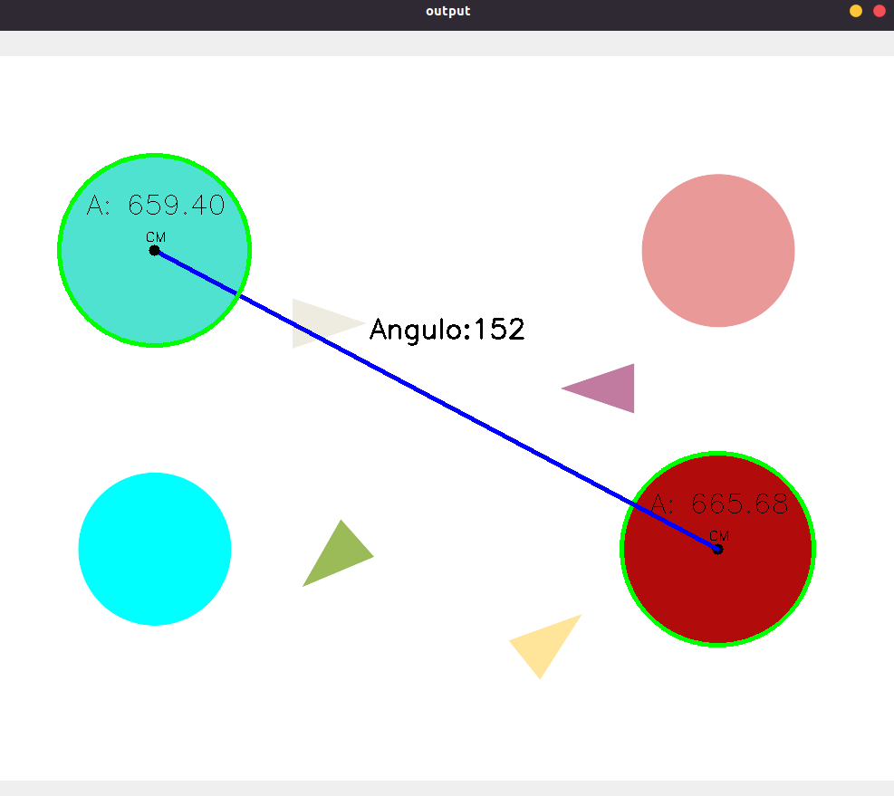

# Circles Fiap

## Execução
<code>python3 circle.py</code>

## Tarefas

- ✅ Segmentar apenas os círculos maiores da imagem, use a técnica que achar melhor. E exibe o resultado
- ✅ Exibe na imagem a área e o centro de massa dos dois círculos segmentados da imagem. O resultado esperado e uma imagem com um marcação no centro indicando o CM e o valor da área
- ✅ Traça uma reta entre os dois centros dos círculos 
- ✅ Calcula o ângulo de inclinação da reta em relação ao plano horizontal, inclinação em graus. O resultado esperado é uma imagem com  uma reta entre centros e valor do ângulo exibido na tela

## Resultado
